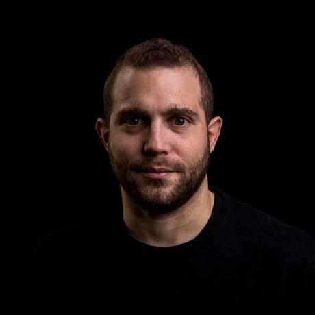

 

## [What I am doing professionally](#what-i-am-doing-professionally)

- Leadership coaching
- Goal setting both on a team level and on a department-wide scale
- Strategic initiatives, e.g. career development, career ladder, technical and managerial initiatives across the engineering department
- Team building on a high level
- Boosting team productivity and happiness

## [What I am looking for in a company](#what-i-am-looking-for-in-a-company)

1. A company that truly cares about employee happiness and motivation.
2. A company that heavily invests into its own employees.
3. A company that respects and empowers its own leadership.

## [My goals in life](#goals-in-life)

1. Help people. Whatever I'm mentally invested in, it should be something that either improves the situation on our planet earth or that advances science. Doing both would be nice.
2. Meet interesting people that challenge my beliefs and from whom I can learn.
3. Create interesting...things. Topics I'm most interested in are math, robotics, genetics, space travel, telepathy and artificial intelligence in general.

## [My inspirations](#my-inspirations)

There are many inspirations and inspirational people in my life. A more or less random selection of the top of my head:

- Mathematicians. My top five:
    1. [Euclid](https://en.wikipedia.org/wiki/Euclid). I especially love his proof that [there are infinitely many primes](https://primes.utm.edu/notes/proofs/infinite/euclids.html)
    2. [Leonhard Euler](https://en.wikipedia.org/wiki/Leonhard_Euler) for being the most prolific mathematician ever.
    3. [Carl Friedrich Gauss](https://en.wikipedia.org/wiki/Carl_Friedrich_Gauss) for coming up with the [Prime Number Theorem](https://en.wikipedia.org/wiki/Prime_number_theorem) at the age of 15.
    4. [Srinivasa Ramanujan](https://en.wikipedia.org/wiki/Srinivasa_Ramanujan) who died too early to become a second Euler.
    5. [John Horton Conway](https://en.wikipedia.org/wiki/John_Horton_Conway) for the [Monstrous moonshine](https://en.wikipedia.org/wiki/Monstrous_moonshine)

- Physicists. Especially everybody that is featured regularly on the best physics channel there is, [Sixty Symbols](https://www.youtube.com/user/sixtysymbols). Other than that I'm fascinated by the early 20th century, which means more or less everybody that attended the [1927 Solvay conference](https://upload.wikimedia.org/wikipedia/commons/thumb/6/6e/Solvay_conference_1927.jpg/700px-Solvay_conference_1927.jpg), Albert Einstein, Max Planck, Nils Bohr, Marie Curie...

- AI Scientists like [Yann LeCun](http://yann.lecun.com/), [Geoffrey Hinton](http://www.cs.toronto.edu/~hinton/) or [Andrew Ng](http://www.andrewng.org/)

- Social activists like [Aaron Swartz](https://en.wikipedia.org/wiki/Aaron_Swartz) or organisations like [Field Ready](https://www.fieldready.org/)

- Psychologist and motivational speakers like [Tony Robbins](https://www.ted.com/talks/tony_robbins_asks_why_we_do_what_we_do) or [Carol Dweck](https://www.ted.com/talks/carol_dweck_the_power_of_believing_that_you_can_improve#t-73105)

- Entrepreneurs like [Tony Hsieh](https://en.wikipedia.org/wiki/Tony_Hsieh) or [Elon Musk](https://en.wikipedia.org/wiki/Elon_Musk). I know it's lame but I also believe Steve Jobs was a genius :)

- Inventors like [Nikola Tesla](https://en.wikipedia.org/wiki/Nikola_Tesla) or [Thomas Edison](https://en.wikipedia.org/wiki/Thomas_Edison)

My favourite inspirational quote at the moment is from Aaron Swartz:

> Be curious. Read widely. Try new things. What people call intelligence just boils down to curiosity.

I follow this advice and try to read as widely as possible  - you can check out my favorite books, newsletters and articles [on my blog](https://troessner.svbtle.com/you-are-what-you-read-watch-and-listen-to).

## [What I bring to the table](#what-i-bring-to-the-table)

- A love for people management and seeing them realize their full potential. 

- Building up teams by recruiting the best people. I'd go as far as to say that team play is 10 times more important than "being an expert" since it's far easier to become good at something than transitioning from being a douche to somebody who can carry and motivate a team. You can read up on my recruiting philosophy [here](https://troessner.github.io/articles/2016-08-15-the-rockstar-ninja-coder-and-you.html).

- Motivation and the passion to motivate others: I believe that vision and purpose on the high level, clear responsibilities and maximum autonomy are the keys to high productivity and happiness.

- The passion to create something that might change change the world. I don't care much for money - my motivation lies elsewhere. This doesn't mean that I work for free, just that I value other things more.

- Excellence in software engineering. I’m obsessed with code quality and writing elegant, maintainable code. I am a regular open source contributor and maintainer of a couple of more or less popular gems. Most notably of the awesome [Reek](https://github.com/troessner/reek) gem - check out [my github profile](https://github.com/troessner/) for more. Additionally you can find quite a few mostly technical articles on [my blog](https://troessner.github.io/articles/).

## [My leadership philosophy](#my-leadership-philosophy)

When it comes to leadership I have 2 core beliefs:

**What makes humans productive?**

- Sharing a common vision that means something to you and others.
- Clearly defined responsibilities. Not in a limiting "you're not allowed to do that" way but rather in a "I know who's taking care of what" way.
- Maximum autonomy. Most startups get this part right because it's the easiest one. Unfortunately it's also the one that can quickly make people unproductive and unhappy when you get the first two items on this list wrong.

**What is leadership?**

- Vision. At least a third of your time should only be invested in developing, nurturing and communicating the vision.
- Mission. That does not mean being involved in the details. That means roadmap and high level metrics.
- Team building
- Strategic initiatives across the company

## [Technologies I have worked with](#technologies-i-have-worked-with)

I have been fully focused on management for the last couple of years or so but back in the day I was a software developer working with a variety of technologies:

- Languages: There's hardly a language I can't find anything positive about it. I have worked with a lot of dynamic languages like Ruby, PHP, Python, javascript and static languages like Java. I also like esoteric languages like brainfuck or whitespace for the fun of it.
- Databases: Over the course of the years I have worked with good old SQL databases (PostgreSQL, mySQL), NoSQL databases (Redis and friends) and Big Data databases (Hbase / Hadoop).
- I spent the majority of my career focusing on backend development (mostly API / SOA environments) but have spent enough time in frontend and mobile development to know my way around.
- Other than that I like and have worked with Amazon cloud, google cloud, git, git branches (yes!), test driven / behaviour driven development and [domain driven design](https://en.wikipedia.org/wiki/Domain-driven_design).

## [Voluntary work](#voluntary-work)

I used to volunteer as a German teacher for refugees at the [Offene Tuer](http://sprengelhaus-wedding.de/offene-tuer-e-v/). I also help out occasionally at the [Berliner Obdachlosenhilfe](http://www.berliner-obdachlosenhilfe.de/) handing out food to homeless people. My most recent activity was giving introductory programming lessons to female immigrants in refugee camps for the [ReDi school](https://www.redi-school.org/berlin) in Berlin.

## [Professional experience](#professional-experience)

#### Oct 2018 – Present / Engineering Manager

[toptal](https://www.toptal.com/)

Toptal is an exclusive network of the top freelance software developers, designers, finance experts, product managers, and project managers in the world. Top companies rely on Toptal freelancers for their most important projects.

#### Jan 2018 – Sept 2018 / Engineering Manager

[ResearchGate](https://www.researchgate.net/), Berlin (Germany)

ResearchGate is changing how scientists share and advance science. It is built by scientists, for scientists. Our mission is to connect the world of science and make research open to all.

#### Oct 2016 – Dec 2017 / Director of Software Engineering

[Planet](https://www.planet.com/), Berlin (Germany)

Planet builds, ships and operates the biggest satellite fleet in the history of mankind. As director of software engineering I'm responsible for building and scaling the software engineering team, develop new and innovative analytical products on top of our vasts amount of data and maintaining our existing production systems. Planet has a strong philanthropic aspect to everything it does and we're always helping communities and researchers to make use of our data in the best way possible.

#### March 2014 – Sept 2016 / Director of Software Engineering

[Blacklane](https://www.blacklane.com/en), Berlin (Germany)

Blacklane is a ride-hailing service that is working world wide with the highest aspirations in regards to quality and customer satisfaction. As director of software engineering I was responsible for scaling the team from 10 to 30 developers, change the underlying architecture to be more microservice focused and evangelize new technologies and clean code conventions.

#### April 2013 – Feb 2014 / Senior Software Developer

[Hitfox Group](http://www.hitfoxgroup.com/), Berlin (Germany)

The Hitfox Group is a company builder and accelerator in the Berlin startup ecosystem. As senior software developer I was working on high load production services and new products. Furthermore I was involved in building team culture, recruiting and clean code guidelines.

## [Education](#education)

* I have a Bachelor of Science in Bioinformatics from the [Freie Universität Berlin](http://www.fu-berlin.de/en/index.html) in 2005.
* I am currently studying mathematics on the side with the final goal of getting a PHD.

## [Contact](#contact)

Mail: timo.roessner [at] gmail.com

## [You can also find me on ...](#find-me-on)

[github](https://github.com/troessner) | [linkedin](https://www.linkedin.com/in/timo-r%C3%B6%C3%9Fner-05ab1630/) | [blog](https://troessner.github.io/articles/)
